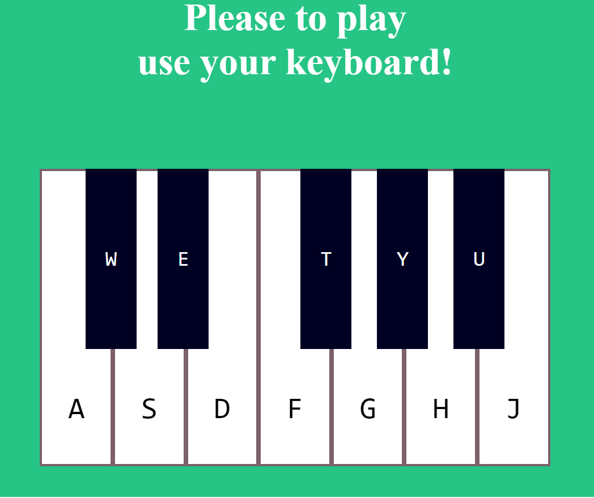

# Objectif of this project

* Create a virtual piano which can be use with some keys of our keyboard.

# How to use the code

* you just have to open the index.html file with a browser.
* after that used the keys of your keyboard corresponding to those specified in the web piano to make some songs and take pleasure.

# ReadMe to complete ...
